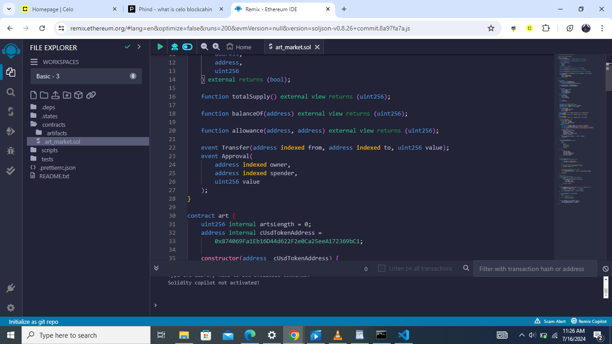
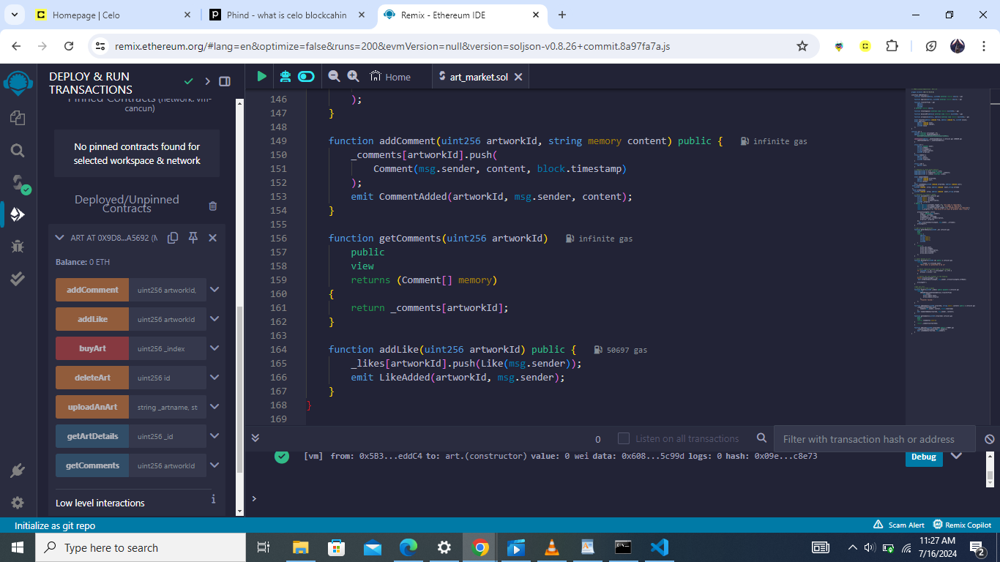
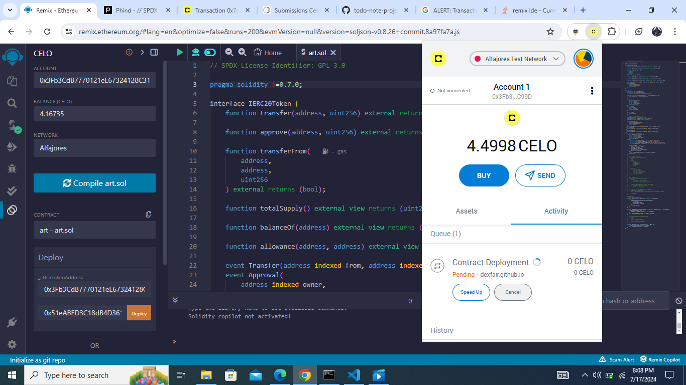
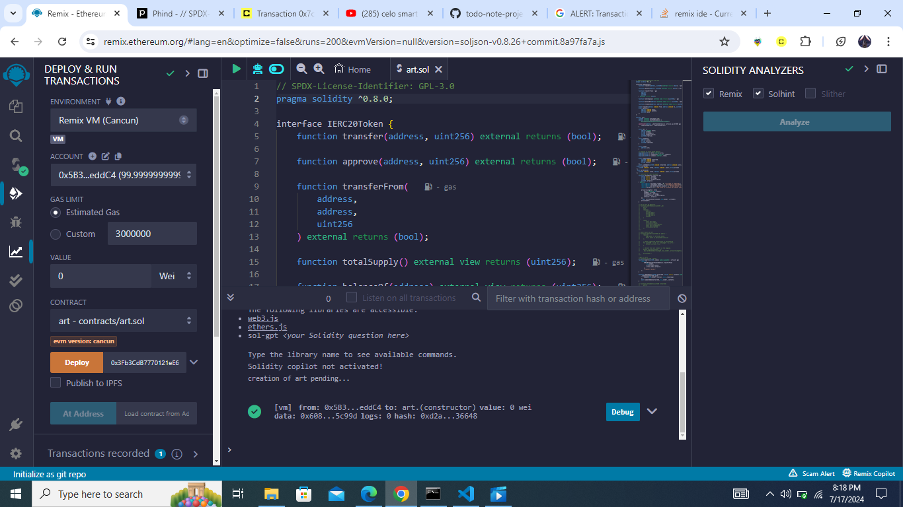
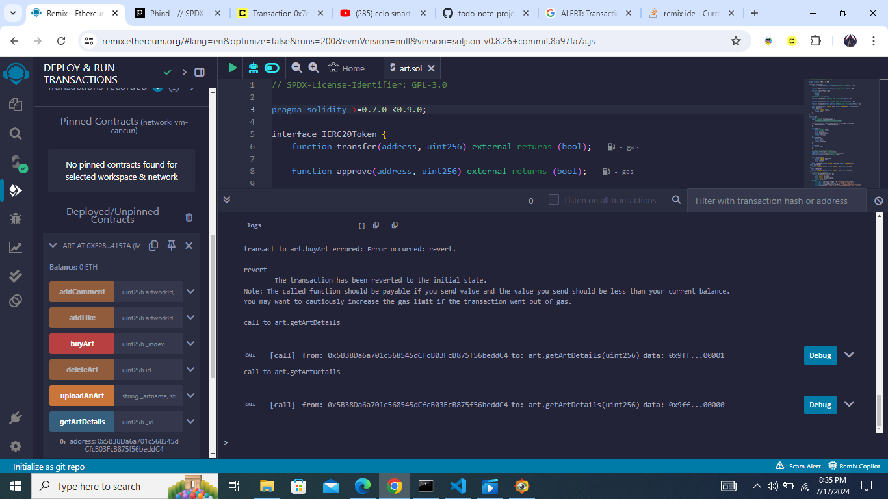

#CELO-101
# ART MARKETPLACE SMARTCONTRACT TUTORIAL

##Table of Contents
    -[Prerequisites](#prerequisites)
    -[Requirements](#requirements)
    -[What is Celo](#what-is-celo)
    -Building our Smart Contract
    -Deploying the Smart Contract
    -Conclusion

##Prerequisites

 For this tutorial we will use [remix](https://remix.ethereum.org/) , an online IDE for web 3 and we won't have to worry about installing the prerequisites.We will you 
 Solidity for coding our smart contarct.Solidity this is the programming language used for writing smart contracts on platforms like Ethereum and Celo.
 Truffle or Hardhat: these are development frameworks for Ethereum that allow you to compile, deploy, test, and debug your smart contracts.
 MetaMask or Celo Extension Wallet these are browser wallet extensions that allow you to interact with the Ethereum or Celo blockchain, respectively.

##Requirements

 Good internet connection
 A basic understanding of Solidity and smart contracts
 A basic understanding of blockchain and Web3
 Building our Smart Contract
##What is Celo?
 Celo is a blockchain platform designed with a focus on financial inclusion, particularly targeting emerging markets. It aims to make cryptocurrency accessible to mobile phone users without requiring sophisticated hardware like traditional Bitcoin miners do.For more details vist [celo](https://celo.org/)

**Building our Smart Contract**

We will go through an example of a celo smart contract written in solidity for art marketplace
Navigate to **Remix IDE**.

Create a new Fileand call it a artmarketplace.sol and paste the following code below
```
    // SPDX-License-Identifier: GPL-3.0

     pragma solidity >=0.7.0 <0.9.0;
```
SPDX-License-Identifier: This is a standard way to identify the license of a software project, It helps in automatically identifying the license of a piece of software, which is crucial for compliance and legal reasons.

pragma solidity >=0.7.0 <0.9.0;

pragma solidity: This line specifies the compiler version for the Solidity code.>=0.7.0 <0.9.0: This range indicates that the smart contract is compatible with Solidity compiler versions 0.7.0 and higher, but less than version 0.9.0. Specifying a range of compiler versions is important because different versions may introduce changes or deprecations in the language syntax or features. By limiting the range, the coder ensures that the contract behaves consistently across a set of compiler versions, avoiding unexpected behavior due to compiler differences.
```
interface IERC20Token {
function transfer(address, uint256) external returns (bool);

    function approve(address, uint256) external returns (bool);

    function transferFrom(
        address,
        address,
        uint256
    ) external returns (bool);

    function totalSupply() external view returns (uint256);

    function balanceOf(address) external view returns (uint256);

    function allowance(address, address) external view returns (uint256);

    event Transfer(address indexed from, address indexed to, uint256 value);
    event Approval(
        address indexed owner,
        address indexed spender,
        uint256 value
    );

}
```
The IERC20Token interface outlines the standard functions and events defined by the ERC-20 token standard.To understand this we will go through each function defined above.

**Why ERC-20?8**
The ERC-20 standard defines a common list of rules for all Ethereum tokens example celo, to follow, ensuring compatibility and predictability among different tokens. By adhering to this standard, token creators enable their tokens to be compatible with a wide range of wallets, exchanges, and decentralized applications (dApps) without needing to build custom interfaces for each integration point.

**Functions**

<span style="color:red">_function transfer(address to, uint256 value)_:</span> This function allows the caller (the sender) to transfer a specified amount of tokens to another address. It's a fundamental operation that enables any holder of tokens to send them to another account. The function returns a boolean indicating success (true) or failure (false).

<span styele="color:red">_function approve(address spender, uint256 value)_</span>: Before a token holder can spend tokens owned by someone else (for example, to pay a fee or make a payment on behalf of the original owner), they must obtain approval from the token owner. This function sets an allowance, specifying how many tokens the spender is allowed to move on behalf of the owner. It also returns a boolean indicating success or failure.

<span styele="color:red">_function transferFrom(address from, address to, uint256 value)_</span>: This function transfers a specified amount of tokens from one address to another. Unlike transfer, which moves tokens from the caller's address, transferFrom allows anyone who has been approved by the token owner to move tokens on their behalf. This is particularly useful for decentralized exchanges and other DeFi applications that need to move tokens between accounts without holding any tokens themselves.

<span styele="color:red">_function totalSupply()_</span>: Returns the total supply of tokens in existence. This is a constant value that represents the maximum number of tokens that will ever exist

<span styele="color:red">_function balanceOf(address account)_</span>: Queries and returns the current balance of tokens held by the specified address. This function is essential for checking the available funds before initiating transactions.

<span styele="color:red">_function allowance(address owner, address spender)_</span>: Returns the remaining number of tokens that the spender is still allowed to draw from the owner's account. This is part of the approval mechanism, allowing holders to see how much of their tokens have been approved for spending by others.

**Events**

<span styele="color:green">_Transfer(address indexed from, address indexed to, uint256 value)_</span>: This event is emitted whenever tokens are transferred from one address to another. The from and to addresses are indexed, meaning they can be queried easily, and the value indicates the amount of tokens transferred. This event is crucial for tracking token movements and auditing transactions.

<span styele="color:green">_Approval(address indexed owner, address indexed spender, uint256 value)_</span>: Emitted when the approve function is called, signaling that the spender is now allowed to withdraw up to a certain amount of tokens from the owner's account. Like the Transfer event, the owner and spender addresses are indexed, facilitating easy queries.
```
contract art {
uint256 internal artsLength = 0;
address internal cUsdTokenAddress =
0x874069Fa1Eb16D44d622F2e0Ca25eeA172369bC1;

    constructor(address _cUsdTokenAddress) {
        cUsdTokenAddress = _cUsdTokenAddress;
    }

}
```
contarct Art{...}.To define a contract in solidity we use name **contract** followed by name of your contract like oures is Art.
uint256 is a data type thata stands for unsigned integer .**Internal** it means that the variable can only be accessed from within the current contract **artLength** represents the count of arts created by user.
**address internal cUsdTokenAddress =0x874069Fa1Eb16D44d622F2e0Ca25eeA172369bC1;** To get ccUsdTokenAddres you need Celo Wallet,You can Install a Celo wallet extension from you browser extension store like chromestore.Finish the neccessary steps for registration.<>Choose you test network for our case we will go with **Alfajores Test Network**.Copy the address and head to [faucet](https://celo.org/developers/faucet) to claim free tokens for deploying your smart contract.
```
    constructor(address _cUsdTokenAddress) {
        cUsdTokenAddress = _cUsdTokenAddress;
    }
```
_constructor_ is executed automatically once when the contract is deployed to the blockchain.
The primary goal of the constructor in this context is to set the address of the Celo USD (cUSD) token, which is represented by the cUsdTokenAddress state variable.By setting this address during deployment, the contract can later reference it for operations involving the cUSD token, such as transferring funds or checking balances.
```
struct Art {
address payable owner;
string artName;
string artimageurl;
string artdescription;
uint256 artprice;
}
struct Comment {
address user;
string content;
uint256 timestamp;
}

    struct Like {
        address user;
    }
```
_Struct_ is a ustom data type that allows you to group together variables of diffrent data types. Structs are particularly useful for organizing related pieces of data.
_address payable owner_;
Type: address payable owner. This field stores the address of the owner of the artwork. The payable keyword allows this address to receive tokens. This is useful for contracts that involve financial transactions, as it enables the contract to send funds to the owner's address.
```
    mapping(uint256 => Art) internal arts;
    mapping(uint256 => Comment[]) internal _comments;
    mapping(uint256 => Like[]) internal _likes;
```
_mappings_ is a powerful data structures for associating unique keys with values. Mappings are essentially hash tables, offering constant-time complexity for reading and writing operations. Each mapping is declared with a specific key type and a value type, and they are all marked as internal, meaning they can only be accessed within the contract or contracts deriving from it.Like in the example above key type is uint256 associated with Art struct as its value which contain details about artwork.
```
event CommentAdded(
uint256 indexed artworkId,
address indexed user,
string content
);
event LikeAdded(uint256 indexed artworkId, address indexed user);
event artCreated(
uint256 indexed artid, address indexed owner,string artname
);
event artDeleted(
uint256 indexed artid, address indexed owner,string artname
);
```
The events outlined above are a core aspect of the art contract, serving as notifications that occur when specific actions take place within the contract.

Explaining the example above _CommentAdded Event_
This event is triggered whenever a new comment is added to an artwork. It includes the following parameters:

artworkId (indexed): A unique identifier for the artwork to which the comment is attached. Indexing this parameter allows for efficient querying of comments by artwork ID.
user (indexed): The address of the user who posted the comment. Indexing this parameter facilitates easy lookup of comments made by specific users.
content: The textual content of the comment itself.

**User upload art function**
```
function uploadAnArt(
string memory \_artname,
string memory \_artimage,
string memory \_artdescription,
uint256 \_artprice
) public {
require(bytes(\_artname).length > 0, "art name is required");
require(bytes(\_artimage).length > 0, "artimage is required");
require(bytes(\_artdescription).length > 0, "artdecription is required");
require(\_artprice > 1, "the price of art must be greater than 1 celo");

        arts[artsLength] = Art({
            owner: payable(msg.sender),
            artName: _artname,
            artimageurl: _artimage,
            artdescription: _artdescription,
            artprice: _artprice
        });
          emit artCreated(artsLength, msg.sender, _artname);
        artsLength++;
    }
```
Function uploadAnArt is used to upload artwork.This function takes four parameters related to the artwork and performs several checks before adding the artwork to the contract's state.To pass parameter into a solidity functon you must define type of data you want to upload.Example
_string memory \_artname_ specifies that \_artname is of type string.memory is a data location which is temporary.
_require_ is used to verify that data that is passed by user meets the requirement required by contract.
_msg.sender_ is the address calling the function

    // get an art by detailas.
    ```
    function getArtDetails(uint256 _id)
        public
        view
        returns (
            address,
            string memory,
            string memory,
            string memory,
            uint256
        )
    {
        return (
            arts[_id].owner,
            arts[_id].artName,
            arts[_id].artdescription,
            arts[_id].artimageurl,
            arts[_id].artprice
        );
    }
```
This function is used to get details of a specific art by passing the art id .

    // owner delete an art
    ```
    function deleteArt(uint256 id) public {
        require(
            msg.sender == arts[id].owner,
            "Only owner is permitted to do so"
        );

        for (uint256 i = id; i < artsLength - 1; i++) {
            arts[i] = arts[i + 1];
        }

        // Delete the last element in the mapping
        delete arts[artsLength - 1];
         emit artDeleted(artsLength, msg.sender, arts[artsLength].artName);

        artsLength--;
    }
```
This function is used to delete art from smart contract.You pass the id of the art.require is used to make sure that its only the owner of the art can delete it.

//function to buy art
```
function buyArt(uint256 \_artid) public payable {
require(
IERC20Token(cUsdTokenAddress).transferFrom(
msg.sender,
arts[_artid].owner,
arts[_artid].artprice
),
"Transfer failed."
);
}
```
This function is used for purchase of art where you pass the artid as parameter.The require statement is used to ensure that a condition is met before proceeding with the function execution. In this case, we perform a transferFrom operation on the ERC-20 token contract specified by cUsdTokenAddress.The first argument to transferFrom is the sender of the tokens, which is the caller of the buyArt function (msg.sender).
The second argument is the recipient of the tokens, which is the owner of the artwork (arts[_artid].owner).
The third argument is the amount of tokens to transfer, which is the price of the artwork (arts[_artid].artprice).
If the transferFrom operation fails (e.g., due to insufficient balance, allowance issues, or incorrect parameters), the require statement will revert the transaction and display the message "Transfer failed."

//This function is used to add comment about an art
```
   function addComment(uint256 artworkId, string memory content) public {
    _comments[artworkId].push(
    Comment(msg.sender, content, block.timestamp)
   );
    emit CommentAdded(artworkId, msg.sender, content); 
   }
   ```
This function takes artid and the comment.It the emit event commentAdded if the function runs successfully.

//function to addlike to an art
```
    function addLike(uint256 artworkId) public {
        _likes[artworkId].push(Like(msg.sender));
        emit LikeAdded(artworkId, msg.sender);
    }
```
This function take art id.when user click like button the address of the user is added to _likes comment.It then emmits events likeAdded


This is the full code 

```solidity
// SPDX-License-Identifier: GPL-3.0

pragma solidity >=0.7.0 <0.9.0;

interface IERC20Token {
    function transfer(address, uint256) external returns (bool);

    function approve(address, uint256) external returns (bool);

    function transferFrom(
        address,
        address,
        uint256
    ) external returns (bool);

    function totalSupply() external view returns (uint256);

    function balanceOf(address) external view returns (uint256);

    function allowance(address, address) external view returns (uint256);

    event Transfer(address indexed from, address indexed to, uint256 value);
    event Approval(
        address indexed owner,
        address indexed spender,
        uint256 value
    );
}

contract art {
    uint256 internal artsLength = 0;
    address internal cUsdTokenAddress =
        0x874069Fa1Eb16D44d622F2e0Ca25eeA172369bC1;

    constructor(address _cUsdTokenAddress) {
        cUsdTokenAddress = _cUsdTokenAddress;
    }

    struct Art {
        address payable owner;
        string artName;
        string artimageurl;
        string artdescription;
        uint256 artprice;
    }
    struct Comment {
        address user;
        string content;
        uint256 timestamp;
    }

    struct Like {
        address user;
    }

    mapping(uint256 => Art) internal arts;
    mapping(uint256 => Comment[]) internal _comments;
    mapping(uint256 => Like[]) internal _likes;

    event CommentAdded(
        uint256 indexed artworkId,
        address indexed user,
        string content
    );
    event LikeAdded(uint256 indexed artworkId, address indexed user);
 event artCreated(
    uint256 indexed  artid, address indexed  owner,string artname
 );
  event artDeleted(
    uint256 indexed  artid, address indexed  owner,string artname
 );
    // Function to upload art
    function uploadAnArt(
        string memory _artname,
        string memory _artimage,
        string memory _artdescription,
        uint256 _artprice
    ) public {
        require(bytes(_artname).length > 0, "art name is required");
        require(bytes(_artimage).length > 0, "artimage is required");
        require(bytes(_artdescription).length > 0, "artdecription is required");
        require(_artprice > 1, "the price of art must be greater than 1 celo");

        arts[artsLength] = Art({
            owner: payable(msg.sender),
            artName: _artname,
            artimageurl: _artimage,
            artdescription: _artdescription,
            artprice: _artprice
        });
          emit artCreated(artsLength, msg.sender, _artname);
        artsLength++;
    }

    // get an art by detailas.
    function getArtDetails(uint256 _id)
        public
        view
        returns (
            address,
            string memory,
            string memory,
            string memory,
            uint256
        )
    {
        return (
            arts[_id].owner,
            arts[_id].artName,
            arts[_id].artdescription,
            arts[_id].artimageurl,
            arts[_id].artprice
        );
    }

    // owner delete an art
    function deleteArt(uint256 id) public {
        require(
            msg.sender == arts[id].owner,
            "Only owner is permitted to do so"
        );

       
        for (uint256 i = id; i < artsLength - 1; i++) {
            arts[i] = arts[i + 1];
        }

        // Delete the last element in the mapping
        delete arts[artsLength - 1];
         emit artDeleted(artsLength, msg.sender, arts[artsLength].artName);
       
        artsLength--;
    }

    //get all arts
    // function to buy art
    function buyArt(uint256 _index) public payable {
        require(
            IERC20Token(cUsdTokenAddress).transferFrom(
                msg.sender,
                arts[_index].owner,
                arts[_index].artprice
            ),
            "Transfer failed."
        );
    }

    function addComment(uint256 artworkId, string memory content) public {
        _comments[artworkId].push(
            Comment(msg.sender, content, block.timestamp)
        );
        emit CommentAdded(artworkId, msg.sender, content);
    }

    function getComments(uint256 artworkId)
        public
        view
        returns (Comment[] memory)
    {
        return _comments[artworkId];
    }

    function addLike(uint256 artworkId) public {
        _likes[artworkId].push(Like(msg.sender));
        emit LikeAdded(artworkId, msg.sender);
    }
}
```


**Testing And Deploying the Smart Contract**
To test the smart contract vist [remix](https://docs.celo.org/developer/deploy/remix).You can install celo extension 
Create Contract: Create a new file for your Solidity smart contract in Remix like ours we will name it as 
*art.sol*.



Compile Contract: Click on the "Solidity Compiler" tab in the sidebar and select the appropriate compiler version for your contract. Click "Compile" to compile your contract code.


Go to your celo wallet that is Alfajores Test Network and copy the address

After copying celo wallet address paste it to the space next to deploy button

if your smart have deployed successfully you will see this



**Conclusion**
In this tutorial, we've explored the process of building a decentralized art markeplace on the Celo blockchain using Solidity smart contracts. 
We’ve learned about various components of the contract, including structs for representing various data types for our contract, mappings for storing these objects, events for logging significant occurrences, and functions for creating art,deleting art,coment,like

